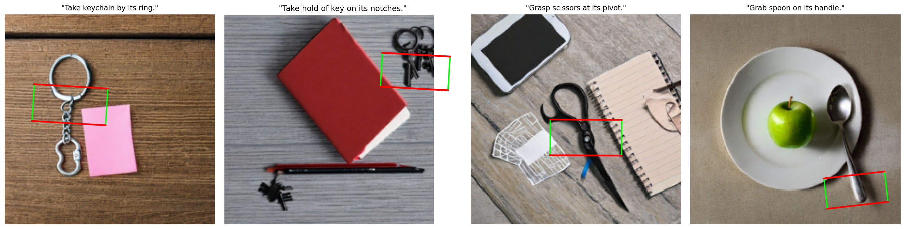
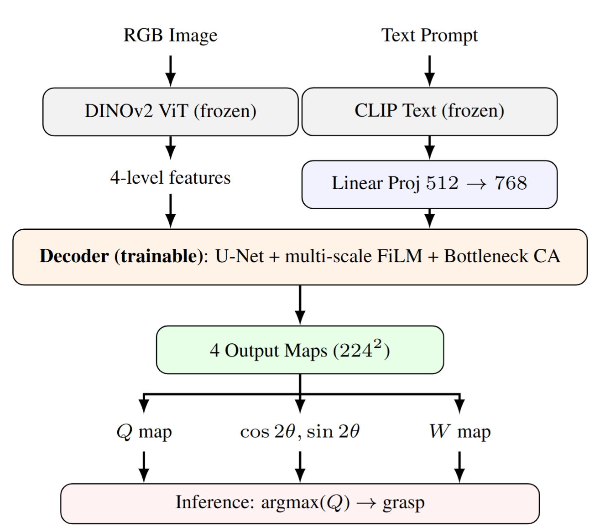

# GraspCLIP-D: Language-driven Grasp Detection via Dense Self-Supervised Features and Multi-Scale FiLM Fusion

<p align="center">
  
</p>

<p align="center">
  <!-- <a href="docs/paper.pdf"></a> -->
  <a href="https://pytorch.org/"></a>
  <a href="https://www.python.org/"></a>
</p>

**TL;DR:** Mô hình phát hiện điểm cầm nắm dựa trên ngôn ngữ (language-driven grasp detection), kết hợp đặc trưng DINOv2 và văn bản CLIP qua FiLM đa tỷ lệ. Đạt **H = 60.2%** trên Grasp-Anything++ với hiệu năng vượt trội.

> *Dự án bài tập khóa FPT AI Residency, Batch 7*

---

## Highlights

- **Discriminative & Nhanh:** Dự đoán grasp trong một single forward pass (~3.2 ms/ảnh).
- **Dense features:** DINOv2 patch features vượt trội hơn CLIP trong việc định vị không gian.
- **Multi-scale fusion:** Điều chế FiLM ở mọi thang đo của decoder kết hợp cross-attention tại bottleneck.

## Architecture

<p align="center">
  
</p>

Gồm 3 phần: **Frozen DINOv2** (hình ảnh), **Frozen CLIP** (văn bản) và **U-Net decoder** (được huấn luyện). Đầu ra gồm 4 bản đồ đặc trưng `{Q, cos 2θ, sin 2θ, W}` để suy luận (inference) ra hình chữ nhật cầm nắm.

## Results (Grasp-Anything++)

| Method                            | Base ↑ | New ↑ | H ↑      |
|-----------------------------------|--------|-------|----------|
| GR-ConvNet (no language)          | 0.74   | 0.61  | 0.67     |
| LGD (diffusion, T=1000 steps)     | 0.48   | 0.42  | 0.45     |
| **GraspCLIP-D (ours)**            | **0.74** | **0.51** | **0.60** |

## Setup & Training

**1. Môi trường:**
```cmd
git clone https://github.com/<your-username>/grasp-clip-d.git
cd grasp-clip-d
python -m venv venv
venv\Scripts\activate
pip install torch torchvision --index-url https://download.pytorch.org/whl/cu121
pip install -r requirements.txt
```

**2. Dữ liệu:**
Sử dụng Grasp-Anything (ảnh gốc) và Grasp-Anything++ (nhãn/câu lệnh) từ HuggingFace. Tải về và giải nén vào thư mục `data/` theo cấu trúc:
```text
data/
├── grasp-anything/
│   └── image/ <SHA256>.jpg
└── grasp-anything-plus/
    ├── grasp_instructions/ <SHA256>_<obj>_<inst>.pkl
    └── grasp_label_positive/ <SHA256>_<obj>_<inst>.pt
```

**3. Huấn luyện (Training):**
```cmd
python train.py --config configs/default.yaml
```

**4. Đánh giá (Evaluation):**
```cmd
python evaluate.py --checkpoint logs/<run>/best.ckpt --split val --base-new
```

## Pre-trained Checkpoints

Bạn có thể tải mô hình đã được huấn luyện sẵn tại đây:
- [best.ckpt (Google Drive)](https://drive.google.com/file/d/1t_KZiZJTY5p0n_U8_2cMMYzavoNFGs2n/view?usp=sharing)

Sau khi tải về, bạn có thể đặt vào thư mục `logs/` hoặc trỏ trực tiếp đường dẫn trong lệnh đánh giá.

## Citation

```bibtex
@misc{graspclipd2025,
  title  = {GraspCLIP-D: Language-driven Grasp Detection via Dense Self-Supervised Features and Multi-Scale FiLM Fusion},
  author = {[Tên của bạn]},
  year   = {2025}
}
```

## Acknowledgments

Nghiên cứu này dựa trên đóng góp mã nguồn mở của: dataset **Grasp-Anything** (Vuong et al.), **DINOv2** (Oquab et al.), **OpenCLIP**, **GG-CNN** và **GR-ConvNet**.
